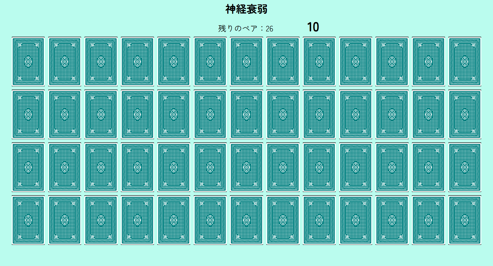
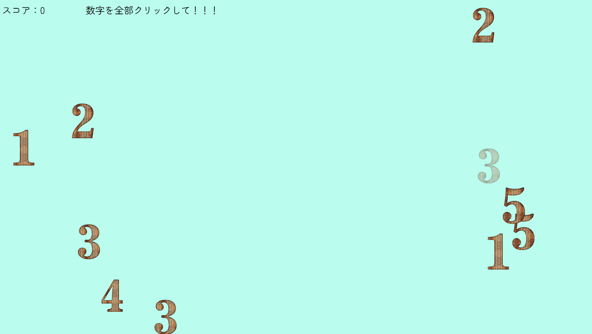

# 神経衰弱ゲーム（妨害ミニゲーム付き）

## 概要
JavaScriptを使用して制作したブラウザで遊べる1人用神経衰弱ゲームです。 

通常の神経衰弱に加えて、**一定時間ごとに妨害ミニゲーム（数字あつめ）が発生する仕組み**を実装しました。

プレイヤーはカードを揃えながら、突然発生するミニゲームをクリアしてゲームオーバーを回避する必要があります。

## ゲームURL
https://yuna031706.github.io/JSGame/

### 妨害ゲーム（数字あつめ）
神経衰弱のプレイ中、10秒ごとに妨害ミニゲームが開始されます。  
画面に表示される数字を9秒以内にすべてクリックする必要があり、制限時間内に達成できなかった場合はゲームオーバーになります。  
神経衰弱の進行中にプレイヤーの集中を妨げる要素として実装しました。

## ゲーム画面
### 神経衰弱

### 数字あつめ

## 使用技術
 - HTML
 - CSS
 - JavaScript

## ゲームの流れ
1. カードをクリックしてめくる
2. 同じ絵柄のカードを揃える
3. **10秒ごとに妨害ミニゲームが発生**
4. **9秒以内にミニゲームをクリアしないとゲームオーバー**
5. すべてのカードを揃えるとクリア

## 主な機能
### 神経衰弱
 - カードをクリックしてめくる機能
 - 同じ絵柄のカードが揃ったか判定する機能
 - 揃わなかった場合にカードを元に戻す機能
 - 残りのペア数の管理
### 妨害ゲーム（数字あつめゲーム）
 - 数字をクリックするとスコアが加算される機能
 - スコアの管理
 - 10秒ごとのイベント発生
 - 9秒の制限時間
 - 失敗時ゲームオーバー

## 工夫した点
 - 通常の神経衰弱にアクション要素を追加しました。
 - 毎回異なるゲーム展開になるよう、カード配置をランダムにしました。
 - 神経衰弱だけでは単調になりやすいため、10秒ごとに妨害ミニゲーム発生する仕組みを実装しました。
 - 妨害ゲームには9秒の制限時間を設定し、緊張感のあるゲーム性を意識しました。
 - プレイヤーが直感的に操作できるよう、シンプルで分かりやすいUIを意識しました。

## 実行方法
index.htmlをブラウザで開いて実行できます。  
プレイする際は全画面表示を推奨しています。

## 制作人数
1人

## 制作時期
2年後期に制作

## 制作期間
授業の単位認定課題として制作  
10コマ（15時間）

